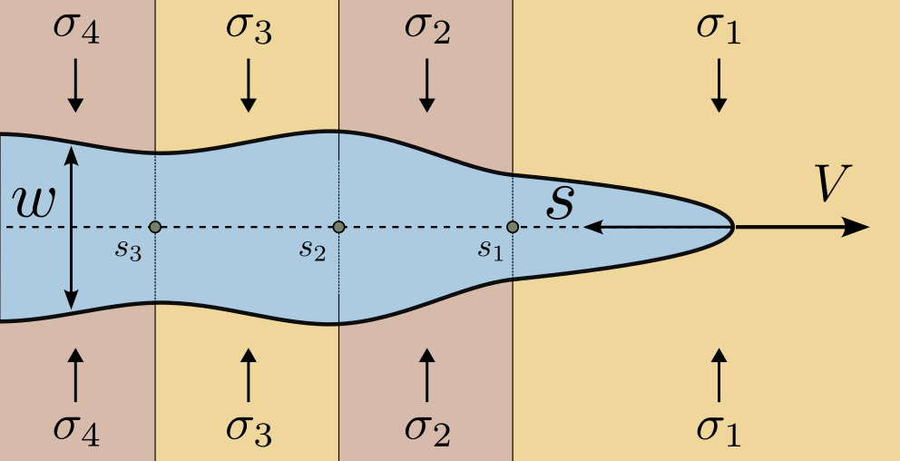
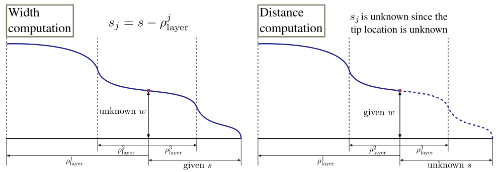

# StressCorrectedAsymptote

The stress-corrected asymptote solves the problem of a semi-infinite fluid-driven fracture propagating through multiple stress layers in a permeable elastic medium. Such a problem represents the tip region of a planar hydraulic fracture.

This module implements three approaches to incorporate the effect of stress layers into the tip asymptote: integral formulation, toughness corrected asymptote, and an ODE approximation. The integral formulation approach involves solving the non-singular integral formulation for the problem. The second, toughness-corrected asymptote, utilizes the universal asymptotic solution and the concept of an effective toughness, which is calculated using the toughness-dominated asymptote and stress intensity factor correction due to stress layers. The ODE approach is based on the ordinary differential equation approximation of the non-singular integral formulation.

The schematics for fracture width and distance to the fracture front computation is shown below. For a detailed description of the mathematical background see [References](#references) section.

## References

- [A.V. Valov, E.V. Dontsov (2023). *"On the layer crossing problem for a semi-infinite hydraulic fracture"*.](https://arxiv.org/abs/2305.13176)
- [A.V. Valov, E.V. Dontsov, A.N. Baykin, S.V. Golovin (2023). *"An implicit level set algorithm for hydraulic fracturing with a stress-layer asymptote"*.](https://arxiv.org/abs/2305.13714)